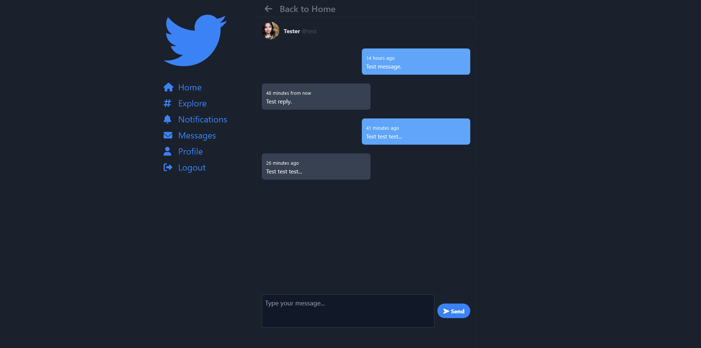

## Birdle
A Twitter Clone.

Birdle is a personal development project. In this project i tried to clone main features of Twitter. Project is made with Laravel and Vue. Also i used Pinia for state management.

This project enlarged my knowledge about mainly Laravel and Vue. Also i improved my knowledge about Websocket and state management.

### Screenshots

Landing page.

Timeline.

Explore page.

Hashtag page.

Notifications

User page.

User media

Followers page.

Messages.
